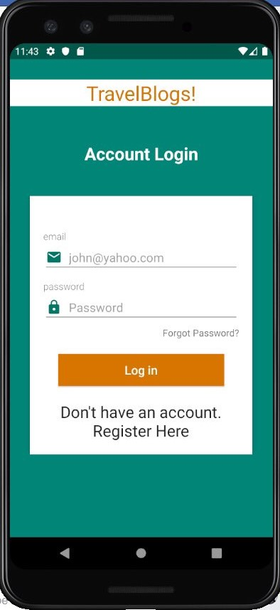
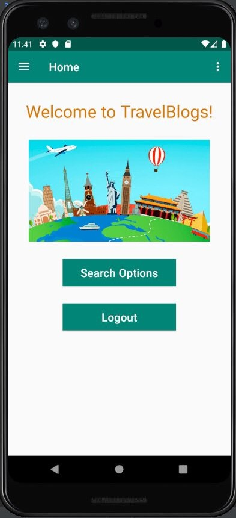
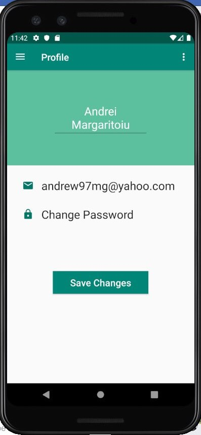
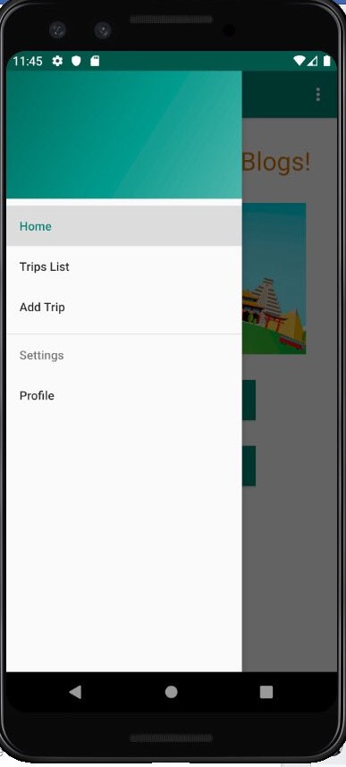
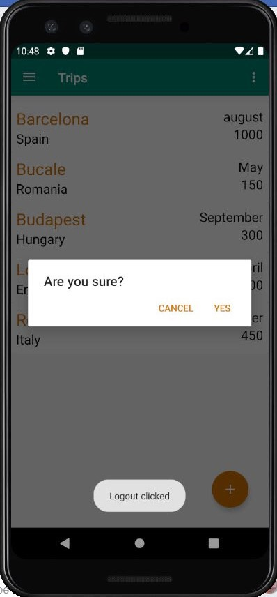
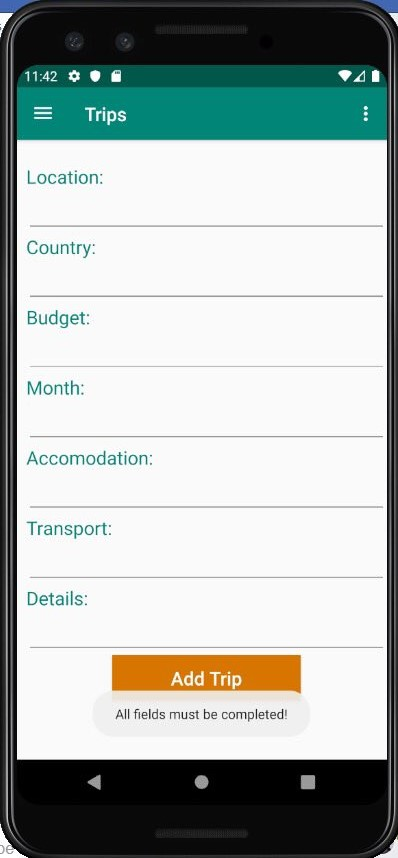
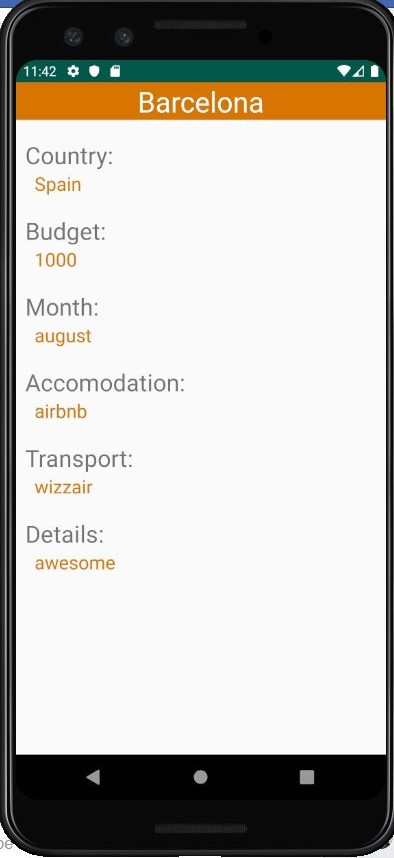

# TravelBlogs

Android application that allows users to create an account, post (and edit) travel blogs and look after blogs posted created by other users.
 
Firebase was used to store the users and the posts.

